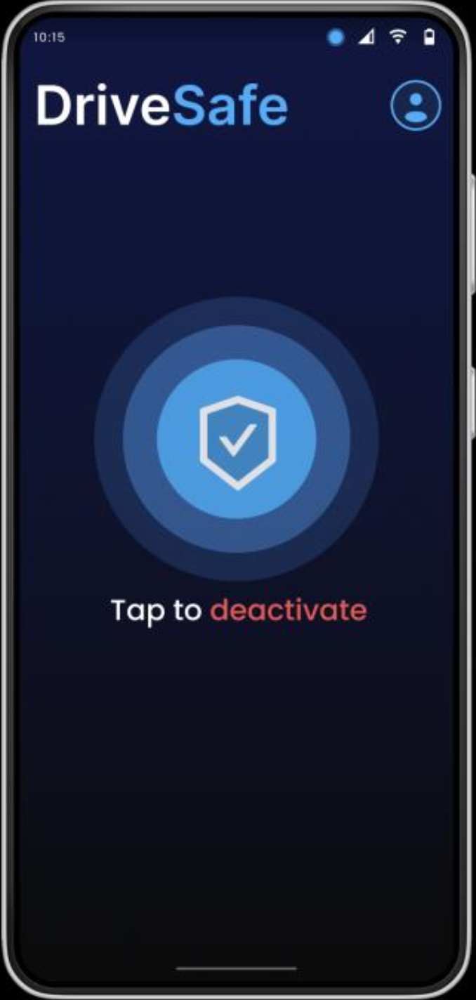
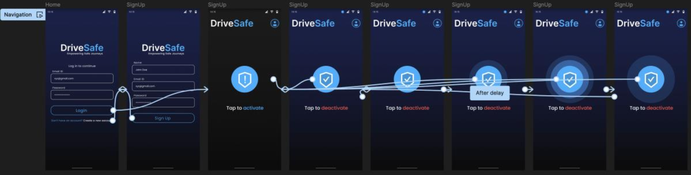

# DriveSafe

## Overview

DriveSafe is a mobile application designed to detect driver drowsiness in real-time. The app integrates a Flutter-based frontend with a Flask backend, utilizing machine learning algorithms for facial recognition and drowsiness detection.

## Table of Contents

1. [Introduction](#introduction)
2. [Features](#features)
3. [Architecture](#architecture)
4. [Setup and Installation](#setup-and-installation)
5. [Usage](#usage)
6. [API Reference](#api-reference)
7. [UI Design](#ui-design)
8. [Contributing](#contributing)

## Introduction

DriveSafe aims to enhance road safety by alerting drivers when they show signs of drowsiness. It uses real-time image processing to monitor the driver's eye movements and triggers alerts when necessary.

## Features

- **User Authentication**: Secure login and registration.
- **Real-Time Drowsiness Detection**: Uses the device's camera to monitor the driver.
- **Alerts**: Immediate alerts when drowsiness is detected.
- **Profile Management**: Allows users to manage their profiles.

## Architecture

### Components

1. **User Interface (UI) Component**:
    - Provides interactive screens for login, dashboard, and profile management.
    
    
2. **Drowsiness Detection Component**:
    - Manages real-time drowsiness detection using the device's camera.
    
    
3. **User Management Component**:
    - Handles user authentication and profile management.
    
    
4. **Flask Backend Component**:
    - Manages backend services and API endpoints.
    
    
5. **External Library Component**:
    - Utilizes external libraries for image processing and drowsiness detection.
    

### Connectors

- **UI Connectors**: Facilitate communication between UI and other components.
- **Drowsiness Detection Connectors**: Connect drowsiness detection with other relevant components.
- **User Management Connectors**: Manage user-related communications.
- **Flask Backend Connectors**: Handle backend communications.
- **External Library Connectors**: Interface with external libraries for image analysis.

## Setup and Installation

### Prerequisites

- Flutter SDK
- Python 3.x

### Installation

1. **Clone the Repository**:
    ```bash
    git clone https://github.com/yourusername/drivesafe.git
    cd drivesafe
    ```

2. **Install Flutter Dependencies**:
    ```bash
    flutter pub get
    ```

3. **Set Up Python Environment**:
    ```bash
    python3 -m venv venv
    source venv/bin/activate
    pip install -r requirements.txt
    ```

4. **Run the Application**:
    - **Flutter**:
        ```bash
        flutter run
        ```
    - **Flask**:
        ```bash
        export FLASK_APP=app.py
        flask run
        ```

## Usage

1. **Login/Register**: Create an account or log in with existing credentials.
2. **Start Detection**: Navigate to the main dashboard and initiate drowsiness detection.
3. **Manage Profile**: Update profile information through the profile management screen.

## API Reference

### User Authentication API

- **Endpoint**: `/api/auth`
- **Methods**: `POST`
- **Description**: Manages user registration and login.

### Drowsiness Detection API

- **Endpoint**: `/api/detect`
- **Methods**: `POST`
- **Description**: Processes video frames for drowsiness detection.

## UI Design

### User Study

- **Objective**: Evaluate the UI for safety and usability.
- **Findings**:
    - Minimalistic design reduces distractions.
    - Dark mode enhances visibility and comfort.
    - Timely alerts are crucial for effectiveness.

### Screen Design

<div style="display: flex;">


</div>

### Navigation Prototype



Check out the interactive [Figma prototype](https://www.figma.com/proto/tg1p7a5psmtDkrKeplm3Cp/SE-project?page-id=0%3A1&type=design&node-id=2-163&viewport=179%2C437%2C0.28&t=CKTVxOHP3cfDyHaF-1&scaling=scale-down&starting-point-node-id=2%3A163&mode=design).

## Contributing

1. Fork the repository.
2. Create a new branch (`git checkout -b feature-branch`).
3. Commit your changes (`git commit -m 'Add new feature'`).
4. Push to the branch (`git push origin feature-branch`).
5. Open a Pull Request.


